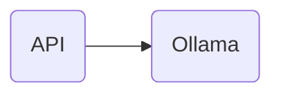

# Yggdrasil

[](https://github.com/dinateimouri/yggdrasil/actions/workflows/test-api.yaml)

Yggdrasil is a project named after [the Norse tree of life](https://en.wikipedia.org/wiki/Yggdrasil). It is basically adding an API layer over [Ollama](https://ollama.com/) deployed on top of [Kubernetes](https://kubernetes.io). The API is responsible to receive multiple prompts and perform some functions such as similarity, offensive contents detection and handling them.



## Prerequisites

To get started with, the following items are required:

- [Kind](https://kind.sigs.k8s.io/)
- [Git](https://git-scm.com/downloads)
- [Docker](https://www.docker.com/)
- [Python](https://www.python.org/)

## Quick start

To get started run the following:

```bash
git clone git@github.com:dinateimouri/yggdrasil.git

./scripts/startup.sh
```

### Running the tests

To minimize the required packages for the stack `unittest` is used. To run the unit tests manually, you need to run:

```bash
python3 -m unittest
```

## Cleanup

To remove all packages run the following:

```bash
./scripts/cleanup.sh
```
