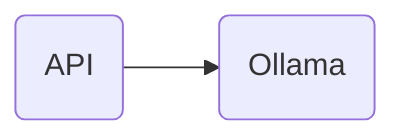
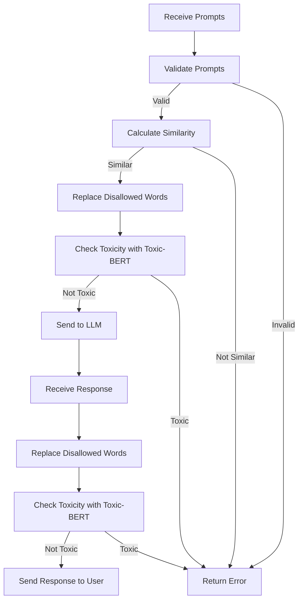

# Yggdrasil

[](https://github.com/dinateimouri/yggdrasil/actions/workflows/test-api.yaml)

Yggdrasil is a project named after [the Norse tree of life](https://en.wikipedia.org/wiki/Yggdrasil). It is basically adding an API layer over [Ollama](https://ollama.com/) deployed on top of [Kubernetes](https://kubernetes.io).



The API processes multiple prompts and returns a response by following these steps:

1. Prompts are checked for validity based on specific requirements such as quantity and content.

2. If they are valid, the API calculates the similarity of the prompts using criteria provided by the user (cosine, euclidean, or manhattan distance), or it uses default that is cosine distance. If the prompts are similar, the first one moves to the next step.

3. For the selected prompt, disallowed words are replaced with * of the same length.

4. The prompt is then evaluated by a model called 'toxic-bert' to make sure it is not toxic. If it meets the threshold, it continues to the next step.

5. The sanitized prompt is sent to the language model (LLM) for a response.

6. The response from the LLM should pass all previous checks (steps 3 and 4) before it is sent back to the user in the specified format.



## Prerequisites

To get started with, the following items are required:

- [Kind](https://kind.sigs.k8s.io/)
- [Git](https://git-scm.com/downloads)
- [Docker](https://www.docker.com/)
- [Python](https://www.python.org/)

## Quick start

To get started run the following:

```bash
git clone git@github.com:dinateimouri/yggdrasil.git

./scripts/startup.sh
```

### Running the tests

To minimize the required packages for the stack `unittest` is used. To run the unit tests manually, you need to run:

```bash
python3 -m unittest
```

## Cleanup

To remove all packages run the following:

```bash
./scripts/cleanup.sh
```
